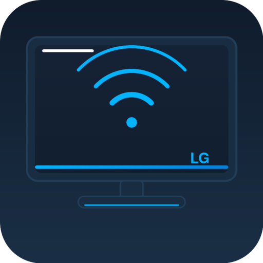

# ioBroker LG TV Full Adapter

<p align="center">
  
</p>

<p align="center">
  <a href="https://github.com/KPIotr89/iobroker.lgtv-full/releases"></a>
  
  
  
  
</p>

<p align="center">
  Full-featured ioBroker adapter for <strong>LG WebOS Smart TVs</strong> — control picture mode, sound mode, inputs, volume, remote control and more.<br/>
  Designed as a replacement for <em>homebridge-lgwebos-tv</em>, tested on <strong>LG OLED77G4</strong> (webOS 24).
</p>

---

## ✨ Features

- 🖼️ **Picture Mode** — read & write (Vivid, Cinema, Filmmaker, Expert, HDR, Dolby Vision…)
- 🎚️ **Picture Settings** — Brightness, Contrast, Backlight / OLED Light, Color, Sharpness
- 🔊 **Sound Mode** — read & write (Standard, Cinema, AI Sound Pro…)
- 🔉 **Audio Output** — switch between TV Speaker, HDMI ARC/eARC, Optical, Bluetooth Soundbar
- 📺 **Input switching** — HDMI 1–4 and all other inputs
- 📡 **TV Channels** — switch by number, see channel name and full list
- 📱 **App launcher** — launch any webOS app by ID (Netflix, YouTube, Disney+…)
- 🎮 **Full remote control** — all physical buttons simulated via ioBroker
- 💡 **Screen off / Screen saver** — without powering off the TV
- ⏯️ **Media state** — detect playback status
- 🌐 **Wake-on-LAN** — turn the TV on remotely
- 🔢 **Numeric states** — numeric mirror for every string state (perfect for MQTT / Loxone)
- 🔔 **Real-time push** — picture & sound changes on TV are reflected instantly in ioBroker (no polling needed)
- 🔄 **Auto-reconnect** — automatic reconnection if TV is turned off or goes to standby

---

## 📋 Requirements

| Requirement | Details |
|-------------|---------|
| **ioBroker** | js-controller ≥ 3.0 |
| **Node.js** | ≥ 14 |
| **LG WebOS TV** | webOS 4+ (fully tested on webOS 24 / LG G4) |
| **Network** | TV and ioBroker on the same local network |
| **Static IP** | Set a DHCP reservation for the TV in your router |

---

## 🚀 Installation

### Via ioBroker Admin (recommended)

1. Open **ioBroker Admin → Adapters**
2. Click the **GitHub** icon (install from custom URL)
3. Enter the URL:
   ```
   https://github.com/KPIotr89/iobroker.lgtv-full
   ```
4. Click **Install** and wait for completion
5. Open the instance settings and configure the TV IP address and MAC address

### Auto-updates via custom repository

To receive automatic update notifications in ioBroker Admin:

1. Go to **Settings → Repositories**
2. Add a new entry with this URL:
   ```
   https://raw.githubusercontent.com/KPIotr89/iobroker.lgtv-full/main/repository.json
   ```
3. Enable **Auto-Upgrade** — ioBroker will notify you (or upgrade automatically) when a new version is published

---

## ⚙️ Configuration

Open the adapter instance settings in ioBroker Admin:

| Field | Example | Description |
|-------|---------|-------------|
| **TV IP Address** | `192.168.1.105` | Local IP of the TV — assign a DHCP reservation in your router |
| **MAC Address** | `A1:B2:C3:D4:E5:F6` | Required for Wake-on-LAN. Found in TV: *Settings → Connection → Network → Advanced* |
| **Reconnect interval** | `10` | Seconds between reconnect attempts when TV is off |

### First connection — Pairing

On the **first run**, the TV will display a pairing prompt on screen.
Accept it with the remote control. The pairing key is saved automatically and pairing is only required once.

> **Note:** If you see a pairing prompt every restart, delete `lgtvkey.txt` from the instance data directory and let it re-pair once.

---

## 📊 States Reference

### 🔌 Power & Screen

| State | Type | R/W | Description |
|-------|------|-----|-------------|
| `power` | boolean | R/W | `true` = turn on via WoL / `false` = turn off |
| `screenOff` | boolean | R/W | Turn the screen off without standby (panel goes dark, TV stays on) |
| `screenSaver` | boolean | R | `true` when screen saver is active |
| `info.connection` | boolean | R | `true` when adapter is connected to the TV |

### 🔊 Audio

| State | Type | R/W | Description |
|-------|------|-----|-------------|
| `audio.volume` | number (0–100) | R/W | Volume level in percent |
| `audio.mute` | boolean | R/W | Mute on/off |
| `audio.soundMode` | string | R/W | Sound mode key (e.g. `cinema`, `aiSoundPro`) |
| `audio.soundModeNum` | number | R/W | Sound mode as number — see table below |
| `audio.soundOutput` | string | R/W | Audio output key (e.g. `tv_speaker`, `external_arc`) |
| `audio.soundOutputNum` | number | R/W | Audio output as number — see table below |

**Sound Modes:**

| # | Key | Label |
|---|-----|-------|
| 1 | `standard` | Standard |
| 2 | `music` | Music |
| 3 | `cinema` | Cinema |
| 4 | `sport` | Sport / Stadium |
| 5 | `game` | Game |
| 6 | `aiSound` | AI Sound |
| 7 | `aiSoundPro` | AI Sound Pro |

**Sound Outputs:**

| # | Key | Label |
|---|-----|-------|
| 1 | `tv_speaker` | TV Speaker |
| 2 | `external_arc` | HDMI ARC / eARC |
| 3 | `external_optical` | Optical Out |
| 4 | `bt_soundbar` | Bluetooth Soundbar |
| 5 | `headphone` | Headphone |
| 6 | `lineout` | Line Out |
| 7 | `tv_external_speaker` | TV + External Speaker |

### 🖼️ Picture

| State | Type | R/W | Description |
|-------|------|-----|-------------|
| `picture.mode` | string | R/W | Picture mode key (e.g. `cinema`, `filmMaker`) |
| `picture.modeNum` | number | R/W | Picture mode as number — see table below |
| `picture.brightness` | number (0–100) | R/W | Brightness |
| `picture.contrast` | number (0–100) | R/W | Contrast |
| `picture.backlight` | number (0–100) | R/W | Backlight / OLED Light intensity |
| `picture.color` | number (0–100) | R/W | Color saturation |
| `picture.sharpness` | number (0–50) | R/W | Sharpness |

<details>
<summary><strong>Picture Modes full list (click to expand)</strong></summary>

| # | Key | Label |
|---|-----|-------|
| 1 | `vivid` | Vivid |
| 2 | `standard` | Standard |
| 3 | `eco` | Eco / APS |
| 4 | `cinema` | Cinema |
| 5 | `sport` | Sport |
| 6 | `game` | Game |
| 7 | `filmMaker` | Filmmaker Mode |
| 8 | `expert1` | Expert (Bright Room) |
| 9 | `expert2` | Expert (Dark Room) |
| 10 | `hdrVivid` | HDR Vivid |
| 11 | `hdrStandard` | HDR Standard |
| 12 | `hdrCinema` | HDR Cinema |
| 13 | `hdrFilmMaker` | HDR Filmmaker |
| 14 | `hdrGame` | HDR Game |
| 15 | `hdrSport` | HDR Sport |
| 16 | `hdrCinemaHome` | HDR Cinema Home |
| 17 | `dolbyHdrVivid` | Dolby Vision Vivid |
| 18 | `dolbyHdrStandard` | Dolby Vision Standard |
| 19 | `dolbyHdrCinema` | Dolby Vision Cinema |
| 20 | `dolbyHdrCinemaBright` | Dolby Vision Cinema Bright |
| 21 | `dolbyHdrFilmMaker` | Dolby Vision Filmmaker |
| 22 | `dolbyHdrGame` | Dolby Vision Game |

> ℹ️ HDR and Dolby Vision modes are only available when the TV receives an HDR/DV signal. The TV will ignore the command if the source doesn't match.

</details>

### 📺 Input / Source

| State | Type | R/W | Description |
|-------|------|-----|-------------|
| `input.current` | string | R/W | Active input ID — write to switch source |
| `input.list` | JSON | R | All available inputs as a JSON object |

### 📡 TV Channels

| State | Type | R/W | Description |
|-------|------|-----|-------------|
| `channel.number` | string | R/W | Current channel number — write to switch |
| `channel.name` | string | R | Current channel name |
| `channel.list` | JSON | R | Full channel map `{ "number": "name" }` |

### 📱 Apps

| State | Type | R/W | Description |
|-------|------|-----|-------------|
| `app.current` | string | R | Currently running app ID |
| `app.launch` | string | W | Write an app ID to launch it |

**Common app IDs:**

| App | ID |
|-----|----|
| Netflix | `netflix` |
| YouTube | `youtube.leanback.v4` |
| Amazon Prime Video | `amazon` |
| Disney+ | `disneyplus` |
| Spotify | `spotify-beehive` |
| Apple TV | `com.apple.appletv` |
| Web Browser | `com.webos.app.browser` |
| Live TV | `com.webos.app.livetv` |
| LG Content Store | `com.webos.app.lgappstv` |

### 🎮 Remote Control

All remote buttons are exposed as writable boolean states under `remote.*`.
Set any button to `true` to simulate a press — it resets to `false` automatically.

| Category | Buttons |
|----------|---------|
| Navigation | `LEFT` `RIGHT` `UP` `DOWN` `OK` |
| System | `HOME` `BACK` `MENU` `EXIT` `INFO` `GUIDE` `MYAPPS` |
| Colour | `RED` `GREEN` `YELLOW` `BLUE` |
| Volume | `VOLUMEUP` `VOLUMEDOWN` `MUTE` |
| Channels | `CHANNELUP` `CHANNELDOWN` |
| Media | `PLAY` `PAUSE` `STOP` `FASTFORWARD` `REWIND` |
| Numbers | `0` `1` `2` `3` `4` `5` `6` `7` `8` `9` |
| Other | `DASH` `ENTER` `CC` `QMENU` `ASPECT_RATIO` `RECENT` `SEARCH` |
| Streaming | `NETFLIX` `AMAZON` `DISNEY` |

---

## 🔢 Numeric States (for MQTT / Loxone)

Every string state (picture mode, sound mode, sound output) has a **numeric mirror state** ending in `Num`.
Both are always in sync — write to either one and the other updates automatically.

This makes integration with systems that prefer numbers (MQTT, Loxone, KNX) straightforward:

```
picture.mode    = "cinema"   ←→   picture.modeNum    = 4
audio.soundMode = "aiSound"  ←→   audio.soundModeNum = 6
audio.soundOutput = "external_arc" ←→ audio.soundOutputNum = 2
```

---

## 🔗 Built-in MQTT Client

Since v1.2.0 the adapter includes a **built-in MQTT client** — no separate ioBroker MQTT adapter needed.

### Configuration

Open the adapter instance settings and fill in the **MQTT Integration** section:

| Field | Default | Description |
|-------|---------|-------------|
| Enable MQTT client | off | Toggle to activate |
| Broker Host | — | IP or hostname of your MQTT broker (e.g. `192.168.1.10`) |
| Broker Port | `1883` | Standard MQTT port |
| Topic prefix | `lgtv` | Base topic for all messages |
| Username | — | Optional broker authentication |
| Password | — | Optional broker authentication |

All MQTT fields are hidden when the client is disabled.

### Topic structure

| Direction | Topic pattern | Example |
|-----------|---------------|---------|
| **TV → broker** (publish) | `{prefix}/state/{name}` | `lgtv/state/picture/mode` → `cinema` |
| **Broker → TV** (subscribe) | `{prefix}/set/{name}` | `lgtv/set/picture/mode` ← `filmMaker` |

All published values use `/` as separator and are **retained** on the broker, so a newly connected client always gets the current state immediately.

### Example topics

```
lgtv/state/info/connection       → true / false
lgtv/state/audio/volume          → 45
lgtv/state/audio/soundMode       → cinema
lgtv/state/audio/soundModeNum    → 3
lgtv/state/picture/mode          → filmMaker
lgtv/state/picture/modeNum       → 7
lgtv/state/picture/backlight     → 30
lgtv/state/input/current         → HDMI_1

lgtv/set/audio/volume            ← 50
lgtv/set/picture/mode            ← cinema
lgtv/set/picture/modeNum         ← 4
lgtv/set/picture/backlight       ← 60
lgtv/set/audio/soundMode         ← aiSoundPro
lgtv/set/power                   ← true / false
```

### Loxone / LoxBerry integration

Point the adapter to your Mosquitto broker running on LoxBerry. In Loxone Config, create **Virtual Inputs** and **Virtual Outputs** mapped to the topics above — no scripting required.

For systems that prefer numbers, use the `Num` variants:
```
picture.modeNum    1–22   (see picture modes table)
audio.soundModeNum 1–7
audio.soundOutputNum 1–7
```

---

## 🛠️ Troubleshooting

<details>
<summary><strong>TV does not respond to Wake-on-LAN</strong></summary>

- Verify the MAC address in TV: *Settings → Connection → Network → Wi-Fi / Wired → View Details*
- Enable "Turn on via Wi-Fi" in TV: *Settings → General → External Devices → Quick Start+*
- The TV must be in standby (not fully unplugged) for WoL to work

</details>

<details>
<summary><strong>Pairing prompt appears on every restart</strong></summary>

The pairing key file was not saved correctly. Check that the adapter has write access to its data directory. If the file exists but is empty, delete it and restart:

```bash
rm /opt/iobroker/iobroker-data/lgtv-full.0/lgtvkey.txt
```

Then restart the adapter and accept the pairing prompt on the TV.

</details>

<details>
<summary><strong>401 insufficient permissions on writes</strong></summary>

This means the adapter was paired with an older manifest that didn't include `WRITE_SETTINGS`. To fix:

1. Stop the adapter
2. Delete the key file: `rm /opt/iobroker/iobroker-data/lgtv-full.0/lgtvkey.txt`
3. Start the adapter
4. Accept the pairing prompt on the TV

</details>

<details>
<summary><strong>"Unknown message OK" popup appears when changing picture / sound mode (webOS 24)</strong></summary>

This popup was shown by webOS 24 (LG G4 and newer) when an external app called `ssap://settings/setSystemSettings` directly. The adapter uses a different approach since v1.2.20: it triggers settings via a Luna service callback inside `createAlert`, bypassing the popup entirely. If you still see the popup, make sure you are running v1.2.29 or later. Check the debug log for `createAlert cb: alertId=` — if you see `alertId=none` the createAlert call failed and the adapter fell back to direct SSAP.

</details>

<details>
<summary><strong>Picture mode does not change (HDR / Dolby Vision modes)</strong></summary>

HDR and Dolby Vision picture modes are only available when the TV receives a compatible signal (e.g. HDR10 or Dolby Vision content from HDMI). The TV will silently ignore the command if the current source doesn't support that mode. This is a TV firmware limitation, not an adapter issue.

</details>

<details>
<summary><strong>Some states show null / not updating</strong></summary>

Check the debug logs in ioBroker Admin (set log level to **debug**). Common causes:
- TV is in standby — states will update after the TV wakes up
- Subscription failed — the adapter will fall back to polling every 60 seconds
- Incorrect setting keys for your TV firmware — post an issue with your debug log

</details>

---

## 📝 Changelog

### 1.2.29
- **Fix:** Critical bug in v1.2.28 — `createAlert` rejected by webOS 24 with `"Message can't be empty"` when `title`/`message` were empty strings; restored single-space values
- **Fix:** Removed all `ssap://input/sendButton` calls (404 on webOS 24)
- Simplified pointer socket: silent no-op on webOS 24 (404), works on older webOS as before
- Added fallback: if `createAlert` fails for any reason, falls back to direct `ssap://settings/setSystemSettings`

### 1.2.28
- Add `CONTROL_MOUSE_AND_KEYBOARD` and `CONTROL_INPUT_TEXT` to unsigned permissions
- Improved pointer socket diagnostics: log actual error message instead of `{}`
- `_setWithAlert`: added `isSysReq: true` + `modal: false` — system-level alert auto-dismisses on webOS 24
- *(contained the empty title/message regression — superseded by 1.2.29)*

### 1.2.27
- Added diagnostic logging for pointer socket failures (revealed 404 on webOS 24)
- `_setWithAlert`: multiple ENTER retries inside createAlert callback

### 1.2.26
- `_setWithAlert`: fallback from ENTER to BACK when modal is active

### 1.2.25
- Fix: move `setTimeout(pressEnter)` inside createAlert callback — it was firing before TV responded

### 1.2.20 – 1.2.24
- Pointer socket text-frame format (`type:button\nname:ENTER\n\n`)
- Various timing and dismiss attempts for webOS 24 alert dialog

### 1.2.0
- **Feature:** Built-in MQTT client — configure broker host, port, credentials and topic prefix directly in adapter settings
- All states published automatically to `{prefix}/state/{name}` with `retain: true`
- Commands received on `{prefix}/set/{name}` — supports strings, numbers and booleans
- No separate ioBroker MQTT adapter required

### 1.1.6
- **Fix:** Use the real LG-signed RSA manifest from lgtv2 — TV now validates the signature and grants `WRITE_SETTINGS`, enabling write operations for picture and sound settings via SSAP

### 1.1.5
- Experimental: Luna notification trick for settings writes (superseded by 1.1.6)

### 1.1.4
- Add `WRITE_SETTINGS` to unsigned permissions array

### 1.1.3
- Add `CONTROL_DISPLAY` to signed manifest permissions

### 1.1.2
- Fix: acknowledge all state changes (no more red values in ioBroker)
- Fix: sync numeric and string states on write

### 1.1.1
- Add numeric mirror states for picture mode, sound mode and sound output (for MQTT / Loxone)

### 1.1.0
- Full English translation of all code, comments, logs and object names
- Push subscriptions for picture and sound settings (instant updates)
- Polling fallback every 60 seconds

### 1.0.0
- Initial release: WebSocket/SSAP on port 3001 (TLS), custom LgTvSocket class, no lgtv2 dependency
- Picture Mode, Sound Mode, volume, mute, inputs, channels, remote control, Wake-on-LAN

---

## 📄 License

MIT — © 2024 KPIotr89

---

<p align="center">
  Made with ❤️ for ioBroker and LG OLED owners<br/>
  Tested on <strong>LG OLED77G4</strong> · webOS 24 · js-controller 7.0
</p>
